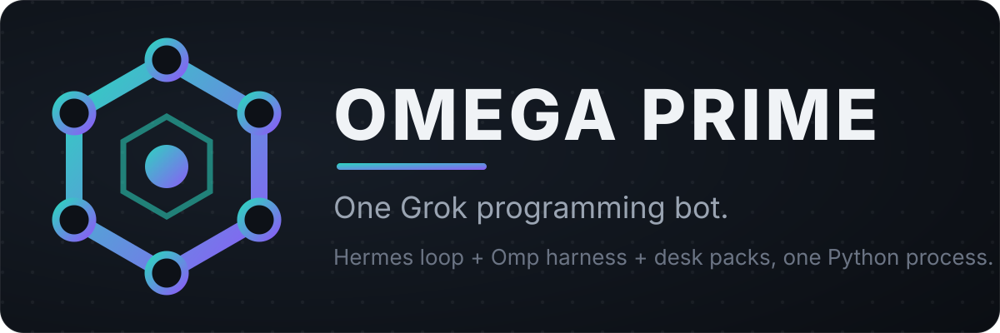

[](https://github.com/swcstudiospace/omes-bot/actions/workflows/ci.yml)
[](LICENSE)
[](pyproject.toml)

# Omega Prime

One Grok programming bot that runs three agents' logic in a single Python
process: the Hermes Agent conversation loop, the oh-my-pi agent harness,
and Prime Agent's recursion and continual-learning capabilities — hardened
enterprise-style, shipped as a Grok Bot Add-Bot product, and wired into the
agent substrate.

## Architecture

One conversation loop: Hermes and Omp behavior ports, with selected Prime
capabilities. `prime.kernel.enabled` (default off) enables pinned Python
runtime tools and native crate helpers. `OmegaPrimeAgent.from_prime` separately
selects the native `pa-ai` provider path for that same loop. No sidecar daemon;
linking all nine crates does not import Prime's entire application runtime.

```
        +-------------------------------------------------------+
        |                Omega Prime (one process)              |
        |                                                       |
        |  conversation loop .................. Hermes Agent    |
        |    +- events, steering, budget, compaction ... Omp    |
        |    +- goals, heartbeats, autonomous mode,             |
        |    |  agent messaging .................. Prime (gated)|
        |    +- RLM recursion (spawn/collect) .... Prime (gated)|
        |    +- continual harness (/refine) ...... Prime (gated)|
        |    +- pinned rlm factory / repl / bash / skills       |
        |    |  and the nine pa-* crates ......... Prime kernel |
        |                                                       |
        |  tool registry -> roster -> policy -> approvals       |
        |    -> receipts                                        |
        +-------------------------------------------------------+
                 |                        |
        omega_prime/prime/        prime-agent/ (ignored checkout)
        typed connector           imported in-process when
        adapters                  prime.kernel.enabled is on
```

The merge architecture is
[docs/adr/0001-prime-merge-architecture.md](docs/adr/0001-prime-merge-architecture.md)
and
[docs/adr/0002-prime-runtime-integration.md](docs/adr/0002-prime-runtime-integration.md).

- **One agent, one process** — registry-backed tools and the existing conversation
  loop, with an explicitly selectable native Prime provider.
- **One tool roster** — coding, browser, devices, X/Telegram/Discord connectors,
  Programming Desk packs, ultrathink, substrate tools, and Prime families.
  Enabled registrations and policy/approval checks determine availability.
  Disabled Prime families are absent from the effective tools and assembled
  tool list; the policy contract remains an allowlist superset.
- **26 skills, 4 routines** — prompt-native flows (sweep, nightly learning,
  ultrathink turns) plus the desk's review and intake routines.
- **Substrate surface** — briefs on open, reports its tool trail with graph
  provenance, shares memory, recalls Hindsight episodes, answers docs from
  RAGflow. Unwired installs run fully local.
- **Verified claims** — the full test suite, deterministic eval cases,
  assembled-prompt checks, and a setup smoke check, all enforced in CI.

## Quickstart

```bash
git clone https://github.com/swcstudiospace/omes-bot.git omega-prime
cd omega-prime
python -m venv .venv && .venv/bin/pip install -e '.[dev]'
git clone --no-checkout https://github.com/PrimeIntellect-ai/prime-agent.git prime-agent
git -C prime-agent checkout "$(.venv/bin/python -c 'import json; print(json.load(open("omega_prime/contracts/prime-agent.pin.json"))["commit"])')"
.venv/bin/python -m pytest omega_prime/tests -q
.venv/bin/python -m omega_prime.setup_check --root .
```

The full Python suite exercises the pinned Prime Python runtime even when the
product's optional Prime flags are off. Provision that read-only checkout before
running the suite; it does not require running the retained failing Rust tests.

Using it as a Grok Bot? Follow [grokbot/SETUP.md](omega_prime/grokbot/SETUP.md):
install, secrets, optional tool host, then the smoke prompt. The remote host
(SSE and Streamable HTTP, scoped tokens, approvals) is
[docs/grok-bot-native.md](docs/grok-bot-native.md); deploying it is
[docs/deploy.md](docs/deploy.md). The Add-Bot
template is [omega_prime/grokbot/templates/OMEGA_PRIME.md](omega_prime/grokbot/templates/OMEGA_PRIME.md).

To turn the Prime capability families on and drive the bot with them, see
[docs/driving-the-bot.md](docs/driving-the-bot.md).

### Program a repo through Grok Bot

Keep the install steps above. From this checkout:

```bash
pip install -r requirements-lock.txt
git submodule update --init --recursive
python -m omega_prime.setup_check --root .
python -m omega_prime.tooling.catalog --check
bash omega_prime/scripts/assemble-prompts.sh --check
python -m omega_prime.grokbot.oneclick --work-root <repo> --dry-run
```

A real attach is `python -m omega_prime.grokbot.oneclick --work-root <repo>`
on loopback with a generated token (`--transport sse --generate-token`).
`OMEGA_PRIME_WORK_ROOT` is the repo the desk tools act on.
`OMEGA_PRIME_STATE_DIR` is where desk state is stored. Railway, Greptile,
Vercel, Play, and ASC stay `not_configured` until their tokens are set.
The served tool count is the roster intersection `setup_check` reports
(109 today). Prime families stay off by default. `delegate_task` is served;
without a provider env it returns `not_configured: provider`.

To call the real tools from outside the bot:

```bash
.venv/bin/python -m omega_prime.mcp_server --root .
```

`--root` is the repository root; coding-tool paths are relative to its
`omega_prime/` directory, matching the shipped seat policy.

## Configuration

Omega Prime runs with zero configuration; every Prime capability family is
off by default. Recorded, source-executed pre-v10 transcripts verify bounded
default-off loop compatibility; this is not a claim of byte-for-byte installation
identity or a fully green unmodified historical suite. Opt in per family via
`omega-prime.json` at the repo root (or
`OMEGA_PRIME_PRIME_<FAMILY>_ENABLED=1` env vars):

```json
{
  "prime": {
    "rlm": { "enabled": true },
    "harness": { "enabled": false },
    "goals": { "enabled": true },
    "heartbeat": { "enabled": false },
    "autonomous": { "enabled": true, "max_turns": 12, "gate": ["pytest", "-q"] },
    "messaging": { "enabled": false }
  }
}
```

The default MCP server registers `harness`, `goals`, `heartbeat`, `autonomous`,
and `kernel` when their flags are on. `rlm` and `messaging` need a live parent
agent or session, so `omega-prime.json` does not add their tools to the MCP
server: for those two the flag only decides whether the assembler offers their
tool entries, and an embedder registers them with its own parent
(`register_rlm_tools`, which requires the explicit `session_dir`,
`session_name`, `delegate_depth`, `max_depth`, and `max_children` contract) or
session (`register_messaging_tools`). A heartbeat job is persisted by
`heartbeat_set` but fires only in a process that bound the named live session
and started the heartbeat runtime.

A disabled family is absent from the live registry and canonical assembled tool
list. Assembly reads no ambient user flags: embedding callers pass effective
configuration to `render`, or use repeated `--enable-family FAMILY` CLI flags,
which require `--output PATH`; the assembled prompt is written to (or, with
`--check`, compared against) that path and the canonical
`prompts-assembled/OMEGA_PRIME.xml` is never written or compared.
`OmegaPrimeAgent` consumes enabled goal and autonomous state at logical-turn
boundaries. Known usage, including tool rounds, accrues once; implicit
continuation shares the caller's iteration cap and budget. Enabled heartbeats
re-enter named live sessions under the same exclusive lease. Use the agent as
a context manager or call `close()` to detach its heartbeat binding.
See [docs/agent-loop.md](docs/agent-loop.md) and
[docs/connectors.md](docs/connectors.md).

## Build from source (both toolchains)

The Python package is the product. `prime-agent/` remains an ignored, read-only
checkout pinned in [VENDOR.md](VENDOR.md). It supplies both the parity oracle and
the libraries loaded by the optional in-process runtime. Build the PyO3 bridge
from the repository root before selecting native providers or kernel tools:

```bash
# The quickstart has already provisioned prime-agent at the contract pin.
cargo build --locked --manifest-path native/omega-prime-prime/Cargo.toml \
  --target-dir prime-agent/target
```

`OmegaPrimeAgent.from_prime` accepts a full model descriptor, a `ToolRegistry`,
and explicit credentials or a `CredentialBroker`; it has no provider fallback.
The native catalog is available through `load_extension().ai.resolve_models()`.
See [the native provider usage](docs/agent-loop.md#native-prime-provider).

```bash
# Python product
.venv/bin/pip install -e '.[dev]'
.venv/bin/python -m pytest omega_prime/tests -q

# Rust parity oracle (optional; use the toolchain pinned in VENDOR.md)
(cd prime-agent && cargo build --locked)
```

The ignored `prime-agent/` checkout must be at the commit recorded in
`omega_prime/contracts/prime-agent.pin.json`. The separate `native` job in
`rust-parity.yml` checks out that pin, builds the product bridge, and checks
its dependency graph against the tracked `deny.toml`. It runs independently
of the upstream parity-test job.

Upstream workspace tests are diagnostics, not a passing local quickstart gate.
The retained baseline is exit 101: 5089 passed, 2 failed, 19 ignored, 3 filtered.
The two local ext4 failures are not skipped or suppressed. [VENDOR.md](VENDOR.md)
records the command, environment, and three older ACP-stdio exclusions.

`pa-cli` differential tests are not in that skip set. They treat
`which prime-agent` as a TypeScript oracle unless `PA_TS_BINARY` is set,
and they skip when that lookup misses. A published CLI on `PATH` is the
wrong oracle. 0.9.8 fails `differential_corpus_matches_ts_binary` because
its package-update error says `prime-agent update --force` and the pinned
Rust CLI says `prime-agent update`. The same binary makes
`ts_daemon_differential_cli_output` run instead of skip: `send` then
exits 1 on both the published CLI and the workspace CLI with
`No API key found for the selected model` (doc paths inside the installed
0.9.8 release) instead of the `Sent to ...` receipt the test requires.
The two stderr strings match; the assertion still fails. CI does not
install that binary. Reproducing the retained diagnostic requires `prime-agent`
absent from `PATH`; it does not turn the two recorded local failures into passes.

Unset provider credentials before the same command, including `GH_TOKEN`,
`GITHUB_TOKEN`, and `OPENROUTER_API_KEY`. With those set, three
`pa-daemon` model tests resolve `github-copilot` instead of the hermetic
catalog. CI does not export them; `rust-parity.yml` unsets them anyway.

`cache_rejects_replacement_and_same_length_in_place_rewrite` stays in the
suite. It expects `futimens` to bump ctime when it restores mtime. On
Linux 6.8.0-142 with this ext4 mount, `futimens` does not, so a
same-length rewrite inside one timestamp tick flakes. That test is not a
pin exclusion. The parity gate is the CI job.

`imported_session_compacts` also stays in the suite. It counts message
rows in the first directory entry named `grown-import*`. The import
writes the session file and `grown-import.window-cache.json`. On this
ext4 mount that sidecar is the first entry, so the count is 0 instead of
3600 after a successful import. `/tmp` here is the root ext4, not a
tmpfs. That test is not a pin exclusion.

## Docs

Start in [docs/](docs/README.md): setup, user guide, tool host, the
[Grok Bot native host](docs/grok-bot-native.md), substrate
surface, the agent loop, connector contracts, migration from pre-v10, the
merge ADR, and the GitBook sync guide. Docs are verified in CI — links
resolve, generated pages stay current.

## Layout

| Path | What lives there |
| --- | --- |
| `omega_prime/` | The product: agent, tools, skills, memory, routines, evals |
| `omega_prime/prime/` | Typed connector adapters over the ported Prime capabilities |
| `omega_prime/prime_kernel/` | In-process loader for the pinned `rlm` runtime, skills, and crate extension |
| `native/omega-prime-prime/` | PyO3 bindings that call all nine Prime crates: goals, autonomous limits, `/goal` and `/autonomous`, the REPL protocol, heartbeats, refinement, plus telemetry, types, providers, the model catalog, tool-argument validation, daemon frames, session search, and CLI modes |
| `omega_prime/grokbot/` | Add-Bot template, setup guide, remote tool host |
| `docs/` | GitBook docs set (`SUMMARY.md` is the nav) |
| `assets/` | Icon and banner art |
| `.planning/` | Milestone history (v1–v10) and the audit trail |
| `VENDOR.md` | Upstream pins and licenses for the ported runtimes |

`hermes-agent/`, `oh-my-pi/`, and `prime-agent/` are local read-only
checkouts. They are gitignored. Hermes and Omp are not imported.
`prime-agent/` stays unmodified; with `prime.kernel.enabled` the process
imports its `rlm` package and can load the crate extension built from that
checkout.

## Contributing

See [CONTRIBUTING.md](CONTRIBUTING.md) for the gates every change must pass,
and [SECURITY.md](SECURITY.md) for reporting vulnerabilities. Be kind:
[CODE_OF_CONDUCT.md](CODE_OF_CONDUCT.md).

## License

AGPL-3.0-only, Copyright (C) 2026 Spectrum Web Co — see [LICENSE](LICENSE).
Upstream runtimes keep their own licenses; ported modules retain their MIT
attributions — see [VENDOR.md](VENDOR.md).
